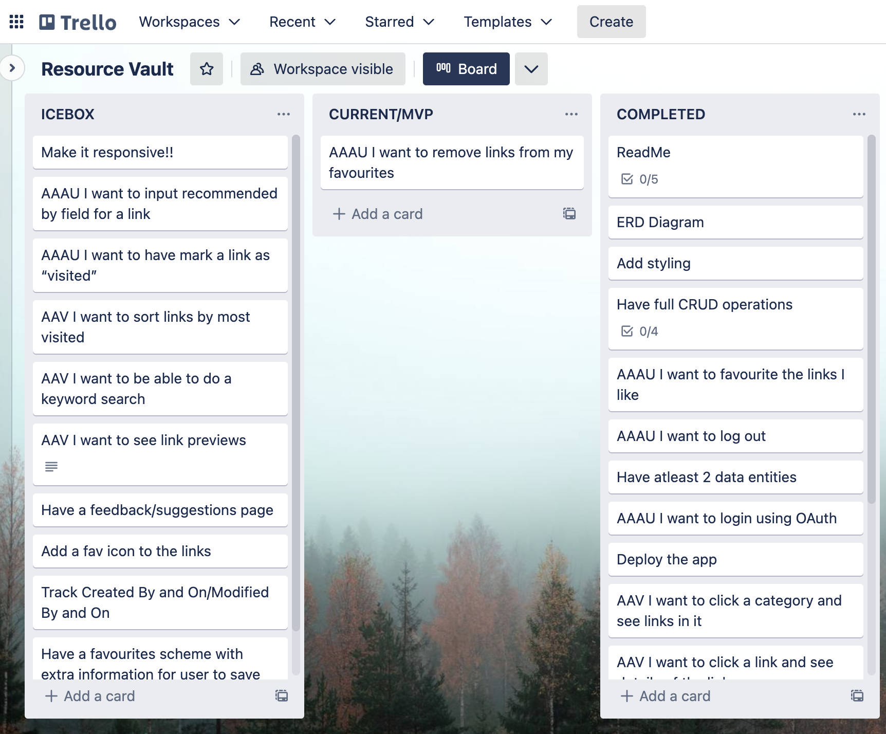
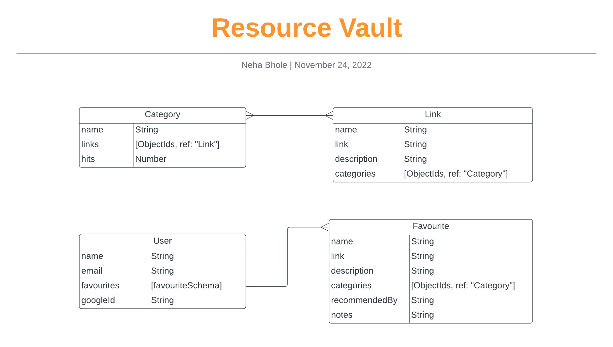

# Resource Vault

by [<b>Neha Bhole</b>](https://www.linkedin.com/in/nehabhole/)

Timeline: 6 days

🗄️ [<b>Checkout Resource Vault</b>](https://resource-vault.up.railway.app/) 

## Table of Contents
- [Resource Vault](#resource-vault)
  - [Table of Contents](#table-of-contents)
  - [Overview](#overview)
    - [First Look](#first-look)
  - [Getting Started](#getting-started)
  - [Development Process](#development-process)
    - [Timeframe \& Working Team](#timeframe--working-team)
    - [Technology Used](#technology-used)
    - [Planning Process](#planning-process)
      - [Brief](#brief)
      - [Wireframes](#wireframes)
      - [Project Management Tool](#project-management-tool)
      - [ERD](#erd)
    - [Build/Code Process](#buildcode-process)
      - [BackEnd](#backend)
        - [Architecture](#architecture)
        - [Database](#database)
        - [API endpoints](#api-endpoints)
        - [Authentication](#authentication)
        - [Scalability](#scalability)
        - [Deployment](#deployment)
      - [FrontEnd](#frontend)
        - [Templates](#templates)
        - [Design and Styling](#design-and-styling)
    - [Challenges/Wins/Key Learning](#challengeswinskey-learning)
    - [Future Implementations](#future-implementations)
  - [Contributors](#contributors)
  - [Author Information](#author-information)

## Overview
<b>Resource Vault</b> is a database of resources and links for students pursuing careers in software development. Built using MongoDB, Express, and Node.js, it allows users to browse a wide variety of categories to find the right resources for their needs. With the added convenience of Google OAuth login, users can easily log in and save their favorite links for quick and easy access later on.

### First Look

## Getting Started

Repo: [Resource Vault](https://github.com/bholeneha/resource-vault)

Deployed here: [Resource Vault](https://resource-vault.up.railway.app/)

Explore the resources by simply click on the "Explore" button in the navigation bar from the landing page. Once you've found a resource that interests you, click on the link to view more information.

To unlock even more features such as the ability to edit links and add to favorites, simply log in using your Google account. This will give you full access to all the features our platform has to offer.

[Back To The Top](#Simon)

## Development Process

### Timeframe & Working Team

<strong>Timeframe:</strong> This project was built in 6 days. 

<strong>Team:</strong> This is a solo project built by: <b>Neha Bhole</b> [📨](mailto:nehasbhole@gmail.com)

### Technology Used
Technologies used for this project are: 
- MongoDB Atlas Cloud Database
- Express
- NodeJS
- Materialize CSS 
- Deployed on Railway App

### Planning Process

#### Brief
Project requirements:

- Build a full-stack CRUD app with Node, Express, and MongoDB
- App should have at least 2 data entities with full-CRUD data operations
- Deploy app 
- Optionally use OAuth authentication, consume a third-party API, or expose its own API that returns data resources as JSON

[Back To The Top](#Simon)

#### Wireframes
The wireframes have been developed using Figma and can be accessed through the link provided below.

[Resource Vault Figma Wireframes ](https://www.figma.com/file/Kt8zj0guLqTyx0ueEIxtYS/Resource-Vault?node-id=0%3A1&t=LIy1FvWZZ2jmyR4i-1)

#### Project Management Tool
Trello was used for project management. 

#### ERD 
Created using Lucid App. 

[Back To The Top](#Simon)

### Build/Code Process

#### BackEnd

<!-- BackEnd Sections -->
##### Architecture

The backend system is built using the Model-View-Controller (MVC) architecture pattern using Node.js and Express.js. This architecture separates the application into three interconnected components: the Model (which handles data and business logic), the View (which presents the data to the user), and the Controller (which handles user input and interacts with both the Model and View).

##### Database 
The project uses MongoDB Atlas as the database for storing data. 

The database for this project includes four models: Category, Link, User, and Favourite. 

Categories and Links have a many-to-many relationship. Each category can have multiple links associated with it and each link can belong to multiple categories. The Category schema is referenced in the Link schema so that links can be queried independently. 

Users and Favourites have a one-to-many relationship, as Favourites will only be queried if a User is defined.

##### API endpoints

| HTTP Method | Endpoint                    | Description                           |
| ----------- | --------------------------- | ------------------------------------- |
| GET         | /categories                 | Get all categories                    |
| GET         | /categories/new             | Render form to create a new category  |
| GET         | /categories/:id             | Get category by ID                    |
| POST        | /categories                 | Create a new category                 |
| DELETE      | /categories/:id             | Delete category by ID                 |
|             |                             |                                       |
| GET         | /links/new                  | Render form to create a new link      |
| POST        | /links                      | Create a new link                     |
| GET         | /links/:id                  | Get link by ID                        |
| GET         | /links/:id/edit             | Render form to edit a link            |
| DELETE      | /links/:id                  | Delete link by ID                     |
| PUT         | /links/:id                  | Update link by ID                     |
|             |                             |                                       |
| GET         | /users/index                | Get all users                         |
| GET         | /users/:id                  | Get user by ID                        |
|             |                             |                                       |
| GET         | /users/:id/favourites       | Get user's favourite links            |
| GET         | /users/:uid/favourites/:fid | Get user's favourite link by ID       |
| POST        | /users/:id/favourites/new   | Render form to create a new favourite |
| POST        | /users/:id/favourites       | Create a new favourite                |
| DELETE      | /users/:uid/favourites/:fid | Delete user's favourite link by ID    |

[Back To The Top](#Simon)

##### Authentication

Users can authenticate themselves using their Google account. The following authentication flow has been implemented in the project:

- The user clicks on the "Login" button, which redirects them to the Google authentication page.
- The user enters their Google account credentials to sign in.
- Once the user is authenticated, they are redirected back to the web app with their user information stored in a session.
- The user can access the web app and perform actions based on their privileges.
- The user can click on the "Logout" button to end their session and log out of the web app.

The authentication is implemented using Google OAuth, and the code for the authentication routes can be found in the index.js file in the routes folder. 

The passport.authenticate() method is used to initiate the authentication flow with Google OAuth. The successRedirect parameter is used to redirect the user to the home page once they are authenticated. The failureRedirect parameter is used to redirect the user to an error page in case the authentication fails.

Once the user is authenticated, their information is stored in the req.user object, which is used to render the appropriate view based on the user's privileges. If the user is an admin, they will have additional privileges, and their isAdmin property will be set to true.

##### Scalability 

This project was developed as a student project with a limited scope and is not intended for large-scale production use. However, the application is designed with scalability in mind, and several steps can be taken to improve its scalability:

- The project uses a scalable database, MongoDB, which can handle large amounts of data.
- The project is built with Node.js and Express, which can handle large amounts of traffic and requests.
- The use of Google OAuth authentication also allows for easy scalability, as it can handle a large number of users.
- However, in order to scale this project, it would require additional work, such as load balancing, optimizing database queries, and implementing caching.

Overall, while this project is not designed for large-scale production use, it is built with scalability in mind and can be adapted to handle increased traffic and users with additional work.

##### Deployment 
For deployment, this app uses Railway. 

[Back To The Top](#Simon)

#### FrontEnd
<!-- FrontEnd Sections -->

##### Templates
The front end of this project is built using EJS templates. Each page is separated into its own file, and there are partials for the header and footer to maintain consistency throughout the application and for efficient code organization and maintenance.

User authentication is implemented to restrict CRUD functionality to authenticated users. The navigation menu changes depending on the login status of the user, with two levels of logged in status: user and admin. While users can create, update and delete links, admins can also create, update or delete categories. This is to prevent incorrect or duplicate categories to be added. Overall, an attempt to maintain data integrity. 

When a user logs in, they are redirected to the home page and their user information is stored in the session. This information is used to determine their level of access and which data they can interact with.

##### Design and Styling

This app uses the Materialize CSS framework for its front-end, providing modern and responsive user interface elements. The design prioritizes simplicity and consistency for easy navigation and readability. The color scheme is consistent throughout the app, without compromising its functionality or performance. Additionally, the interface has been designed with a minimalist and clean look to enhance its user-friendliness. While the styling is a work in progress, efforts have been made to make it visually appealing and functional, and future improvements could be made to enhance the overall look and feel of the app.

[Back To The Top](#Simon)

### Challenges/Wins/Key Learning

[Back To The Top](#Simon)

### Future Implementations 
Here are some ideas for future improvements and features that could be added to the app:
- Complete the favourites feature
- Improve styling and user interface
- Make it responsive
- Add link previews
- Add keyword search
- Track hits to a category and link to display top 5
  
[Back To The Top](#Simon)

## Contributors
This is a solo project built by: 
  <b>Neha Bhole</b> [📨](mailto:nehasbhole@gmail.com)

## Author Information

- [LinkedIn ](https://www.linkedin.com/in/nehabhole/)
- [Portfolio Website](https://nehabhole.com/)
  
[Back To The Top](#Simon)
