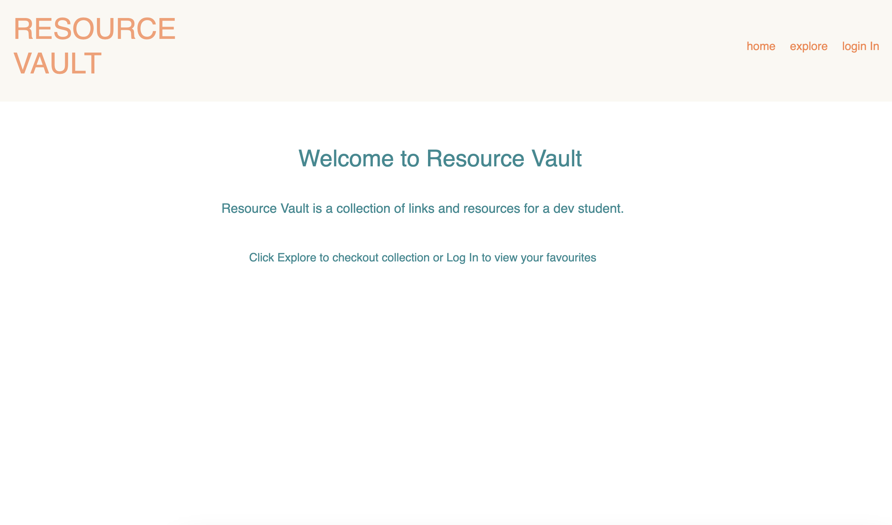
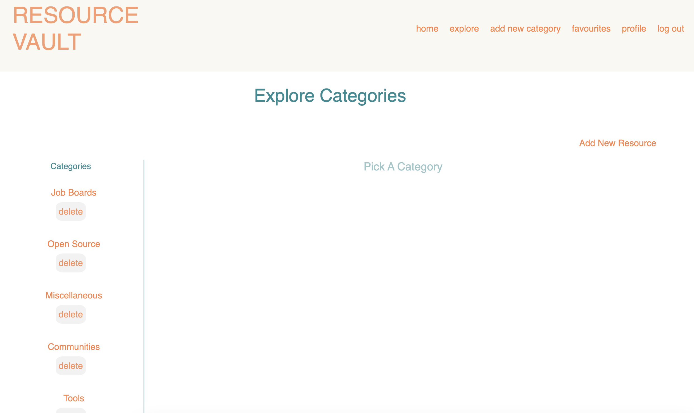
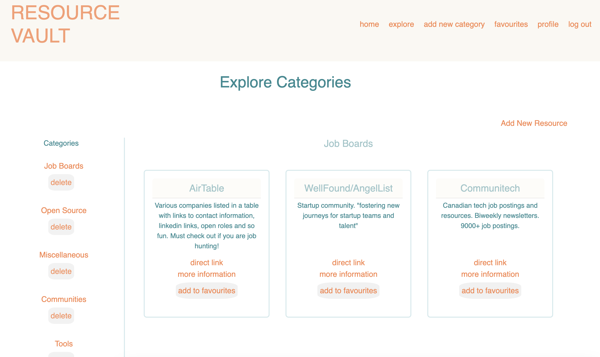
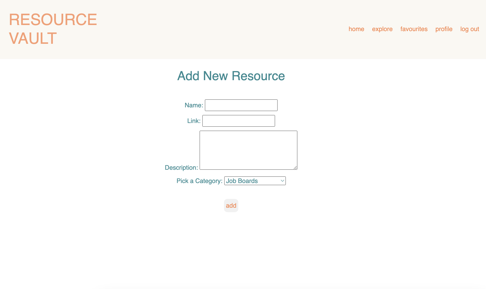
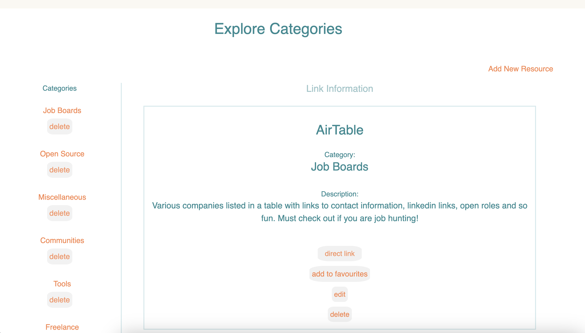

# Resource Vault

Resource Vault is a collection of links and resources for a dev student. 

## First Look

### Landing Page
 

### Categories Page

### Links View 

### Add New Link Page

### Link View

## Technology Used
- MongoDB Atlas Cloud Database
- Express
- NodeJS
- Boostrap CSS
- Deployed on Railway App

## Getting Started

Repo: [Resource Vault](https://github.com/bholeneha/resource-vault)

Deployed here: [Resource Vault](https://resource-vault.up.railway.app/)

Explore the resources by clicking explore in nav bar from the landing page. Click the clink to view more information. Get access to more feature - elibility to edit links, adding to favourites - by logging in using google. 

## Next Steps 
- Add favourites feature
- Improve styling and user interface
- Make it responsive
- Add link previews
- Add keyword search
- Track hits to a category and link to display top 5 
- Add properties to the models